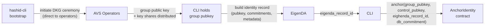
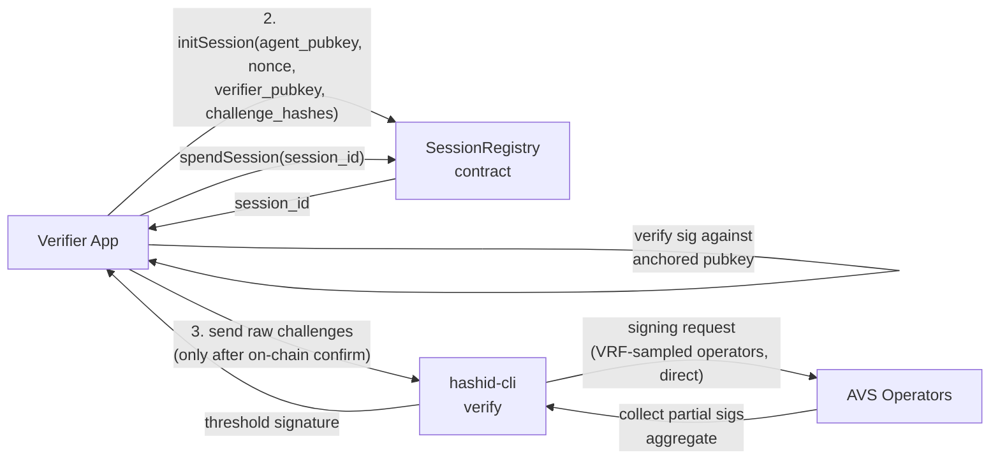

# HashID System Architecture

HashID is a distributed key custody system for agent identity. An agent's signing key is never held by a single party — it is split across a network of staked Ethereum operators using FROST threshold signatures. This document describes the high-level architecture of that system.

---

## C4 Container Diagram

The diagram below shows all containers and their interactions. EigenLayer components (the AVS operators, on-chain operator registry, and EigenDA) are grouped together. The Ethereum chain is a separate node receiving on-chain calls. The agent communicates with operators directly via the on-chain registry — there is no off-chain coordinator.

```mermaid
graph TB
    CLI["hashid-cli\n(Node.js / TypeScript)\npackages/hashid-cli"]
    VA["Verifier App\n(Hono HTTP server)\napps/verifier"]

    subgraph EigenLayer
        OR["Operator Registry\n(on-chain endpoints,\npubkeys, stake)"]
        subgraph Operators["Staked Operators"]
            OP1["Operator 1\n(FROST key share)"]
            OP2["Operator 2\n(FROST key share)"]
            OPN["Operator N\n(FROST key share)"]
        end
        EDA["EigenDA\n(data availability layer)"]
    end

    subgraph Ethereum["Ethereum (on-chain)"]
        SR["SessionRegistry\n(verifier bond, initSession,\nnonces, rate limiting)"]
        AI["AnchorIdentity\n(group_pubkey, control_pubkey,\neighenda_record_id, db_commitment,\nguardian, succession chain)"]
        SUC["SuccessionRegistry\n(commit-reveal succession,\n24h timelock, guardian veto)"]
    end

    CLI -->|"bootstrap: run DKG\ndistribute key shares"| OP1
    CLI -->|"bootstrap: run DKG\ndistribute key shares"| OP2
    CLI -->|"bootstrap: run DKG\ndistribute key shares"| OPN
    CLI -->|"store identity record"| EDA
    CLI -->|"anchor pubkey + record id"| AI

    VA -->|"register + bond"| SR
    VA -->|"initSession"| SR
    VA -->|"issue challenges"| CLI
    VA -->|"verify threshold sig"| CLI
    VA -->|"spend session nonce"| SR

    CLI -->|"lookup endpoints + pubkeys"| OR
    CLI -->|"partial signing request\n(VRF-sampled, direct)"| OP1
    CLI -->|"partial signing request\n(VRF-sampled, direct)"| OP2
    CLI -->|"partial signing request\n(VRF-sampled, direct)"| OPN
    OP1 -->|"partial signature"| CLI
    OP2 -->|"partial signature"| CLI
    OPN -->|"partial signature"| CLI

    CLI -->|"rekey: resharing ceremony"| OP1
    CLI -->|"rekey: resharing ceremony"| OP2
    CLI -->|"rekey: resharing ceremony"| OPN
    CLI -->|"rotate: succession entry"| AI
    CLI -->|"rotate: commitSuccession\nrevealSuccession"| SUC
    CLI -->|"rotate: commitControlKeyRotation\nrevealControlKeyRotation"| SUC
    CLI -->|"veto: vetoSuccession"| SUC
```

**hashid-cli** is the agent-side tool. It is the only component that initiates key ceremonies and signs on behalf of the agent. It never holds the full private key — it contacts operators directly, using the on-chain operator registry to resolve endpoints and public keys, to produce threshold signatures.

**Verifier App** is an HTTP service run by a relying party. It registers on-chain, opens sessions, issues challenges to an agent, and closes sessions once a valid threshold signature is verified.

**EigenLayer AVS** is the operator network. Each operator holds exactly one FROST key share and enforces session policy before co-signing. Operators register their HTTP endpoints and AVS public keys in the on-chain operator registry, allowing agents to contact them directly without an intermediary. Operators are the same set that secures EigenDA, giving the system unified cryptoeconomic security.

**EigenDA** is the data availability layer. Agent identity records (containing the group public key, key share commitments, and metadata) are written here. The returned `eigenda_record_id` is anchored on-chain.

**On-chain contracts** provide the trust root. `AnchorIdentity` stores the binding between an agent's public key, its EigenDA record, and optional guardian address. `SessionRegistry` manages verifier registration (with bond), session lifecycle, single-use nonces, per-verifier rate limiting (max 10 open sessions), per-agent signing rate limiting (max 60 requests/hour), session expiry, and `slashNonceReuse` (lazy fraud proof using operator-signed nonce commitments). `SuccessionRegistry` handles both full keypair rotation (`commitSuccession` / `revealSuccession`) and standalone control key rotation (`commitControlKeyRotation` / `revealControlKeyRotation`) via commit-reveal schemes with mandatory 24-hour timelocks and guardian veto capability.

---

## Data Flow: Bootstrap

The bootstrap flow establishes a new agent identity. The CLI drives a FROST Distributed Key Generation (DKG) ceremony, publishes the resulting identity record to EigenDA, then anchors it on Ethereum.

After bootstrap completes: each operator holds one FROST key share, EigenDA holds the identity record, and the Ethereum contract holds the canonical public key binding. No single operator — and not the CLI itself — can reconstruct the private key.

---

## Data Flow: Verification

The verification flow allows a relying party to cryptographically confirm an agent's identity. The verifier opens a session on-chain, challenges the agent, and the agent responds with a threshold signature produced by contacting a VRF-sampled operator subset directly.

Session spending is single-use. Once a session nonce is spent on-chain it cannot be replayed. Per-verifier rate limiting (max 10 concurrent open sessions) and session expiry are enforced by `SessionRegistry` to prevent denial-of-service against the operator network.
