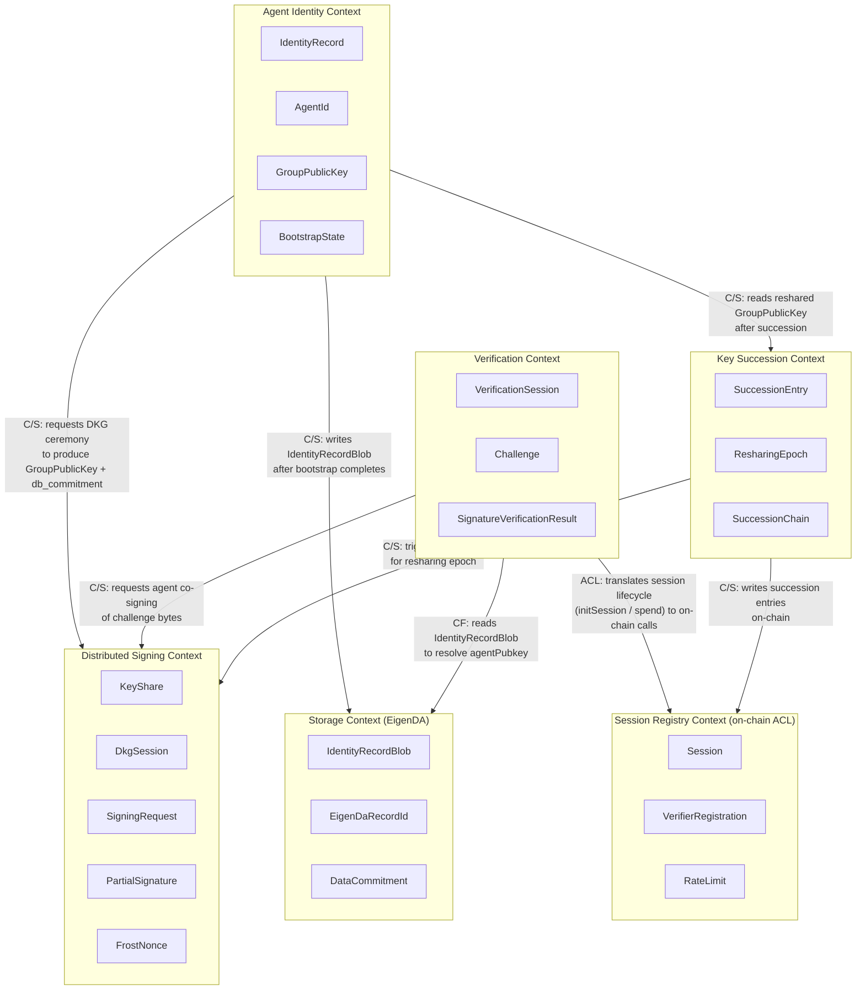

# HashID Bounded Contexts

This diagram maps the six bounded contexts that make up HashID's distributed key custody system. Each context owns its own aggregates and language. The relationships between contexts are annotated with their integration pattern: Customer/Supplier (C/S) where one context depends on another's published interface, Conformist (CF) where a downstream adopts the upstream model wholesale, and Anti-Corruption Layer (ACL) where a translation boundary isolates a foreign model.

The critical path through the system is: an agent bootstraps (Agent Identity Context) by running a DKG ceremony (Distributed Signing Context) and anchoring the result to EigenDA (Storage Context). At runtime, a verifier opens a session on-chain (Session Registry Context / Verification Context), the agent signs challenges (Distributed Signing Context), and the session is spent on-chain to complete verification. Key succession reshapes the key share set (Key Succession Context) and writes a new identity record without changing the agent's logical identity.

## Context Map Legend

| Pattern | Meaning |
|---|---|
| Customer/Supplier (C/S) | Downstream context depends on an interface published by the upstream; upstream must not break consumers |
| Conformist (CF) | Downstream adopts the upstream model as-is with no translation layer |
| Anti-Corruption Layer (ACL) | A translation boundary sits between the downstream and a foreign/legacy model (here: the on-chain contract ABI) |
