# HashID Domain Model

This diagram shows the aggregate roots, entities, and value objects that make up the HashID domain. Aggregate roots are the consistency boundaries: no external context may modify the internals of an aggregate except through its root. Entities have identity and mutable state. Value objects are immutable and identified only by their value.

Composition (`*--`) indicates that the child cannot exist outside the aggregate root's lifecycle. Association (`-->`) indicates a reference by identity (typically a string ID or a value object) that crosses an aggregate boundary.

```mermaid
classDiagram

    %% ── Value Objects ─────────────────────────────────────────────

    class Ed25519PublicKey {
        <<value object>>
        +bytes: Uint8Array
        +toBase58() string
        +equals(other: Ed25519PublicKey) boolean
    }

    class Ed25519Signature {
        <<value object>>
        +bytes: Uint8Array
        +verify(pubkey: Ed25519PublicKey, message: Uint8Array) boolean
    }

    class OperatorId {
        <<value object>>
        +address: string
        +equals(other: OperatorId) boolean
    }

    class OnChainSessionId {
        <<value object>>
        +value: string
    }

    %% ── Agent Identity Context ────────────────────────────────────

    class IdentityRecord {
        <<aggregate root>>
        +agentId: string
        +thresholdPubkey: Ed25519PublicKey
        +controlPubkey: Ed25519PublicKey
        +eigenDaRecordId: string
        +dbCommitment: Ed25519Signature
    }

    class SuccessionEntry {
        <<entity>>
        +oldPubkey: Ed25519PublicKey
        +newPubkey: Ed25519PublicKey
        +timestamp: number
        +reason: string
        +signature: Ed25519Signature
    }

    IdentityRecord --> Ed25519PublicKey : thresholdPubkey / controlPubkey
    IdentityRecord --> Ed25519Signature : dbCommitment
    SuccessionEntry --> Ed25519PublicKey : oldPubkey / newPubkey
    SuccessionEntry --> Ed25519Signature : signature

    %% ── Distributed Signing Context ──────────────────────────────

    class DkgSession {
        <<aggregate root>>
        +sessionId: string
        +threshold: number
        +total: number
        +operators: OperatorId[]
        +status: PENDING | ROUND1 | ROUND2 | COMPLETE | ABORTED
        +groupPublicKey: Ed25519PublicKey | null
    }

    class KeyShare {
        <<entity>>
        +operatorId: OperatorId
        +agentPubkey: Ed25519PublicKey
        +shareIndex: number
        +epoch: number
        +shareBytes: Uint8Array
    }

    class PartialSignature {
        <<entity>>
        +operatorId: OperatorId
        +bytes: Uint8Array
    }

    class FrostNonce {
        <<entity>>
        +operatorId: OperatorId
        +commitment: Uint8Array
        +scalar: Uint8Array
    }

    class SigningRequest {
        <<aggregate root>>
        +requestId: string
        +sessionId: OnChainSessionId
        +message: Uint8Array
        +sampledOperators: OperatorId[]
        +partialSignatures: Map~OperatorId, PartialSignature~
        +status: PENDING | ASSEMBLING | COMPLETE | EXPIRED
        +assembledSignature: Ed25519Signature | null
    }

    DkgSession --> OperatorId : operators[]
    DkgSession --> Ed25519PublicKey : groupPublicKey
    KeyShare --> OperatorId : operatorId
    KeyShare --> Ed25519PublicKey : agentPubkey
    SigningRequest *-- PartialSignature : accumulates
    SigningRequest *-- FrostNonce : uses per operator
    SigningRequest --> OnChainSessionId : sessionId
    SigningRequest --> OperatorId : sampledOperators[]
    SigningRequest --> Ed25519Signature : assembledSignature

    %% ── Verification Context ─────────────────────────────────────

    class VerificationSession {
        <<aggregate root>>
        +sessionId: OnChainSessionId
        +agentPubkey: Ed25519PublicKey
        +verifierPubkey: Ed25519PublicKey
        +nonce: Uint8Array
        +status: OPEN | SPENT | EXPIRED
        +challenges: Challenge[]
        +signatures: Ed25519Signature[] | null
    }

    class Challenge {
        <<entity>>
        +index: number
        +payload: Uint8Array
        +issuedAt: number
    }

    VerificationSession *-- Challenge : contains up to 5
    VerificationSession --> OnChainSessionId : sessionId
    VerificationSession --> Ed25519PublicKey : agentPubkey / verifierPubkey
    VerificationSession --> Ed25519Signature : signatures[]

    %% ── Key Succession Context ───────────────────────────────────

    class ResharingEpoch {
        <<aggregate root>>
        +epochId: string
        +previousPubkey: Ed25519PublicKey
        +newPubkey: Ed25519PublicKey
        +dkgSessionId: string
        +status: PENDING | COMPLETE | ROLLED_BACK
    }

    class SuccessionChain {
        <<aggregate root>>
        +agentId: string
        +entries: SuccessionEntry[]
        +activePubkey: Ed25519PublicKey
    }

    SuccessionChain *-- SuccessionEntry : ordered chain
    SuccessionChain --> Ed25519PublicKey : activePubkey
    ResharingEpoch --> Ed25519PublicKey : previousPubkey / newPubkey
```

