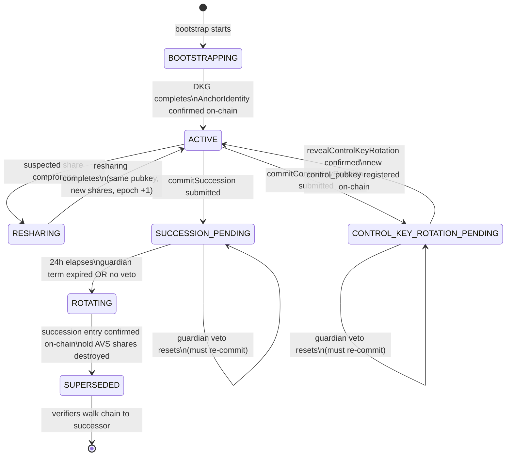
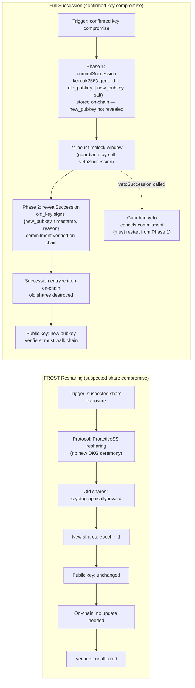
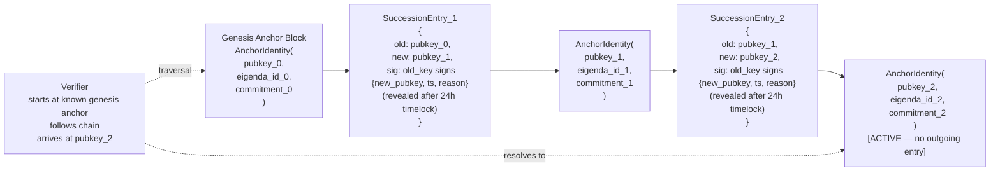
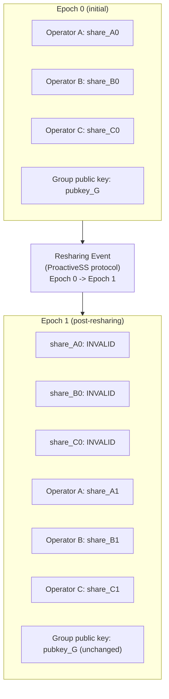

# Key Lifecycle Management

This document describes how the agent keypair is managed across its full lifecycle, covering state transitions, the distinction between FROST resharing and full succession, the on-chain succession chain structure, and how share epochs are invalidated during resharing.

---

## Section 1: Key Lifecycle State Machine

The agent keypair moves through five states. BOOTSTRAPPING and ROTATING both represent active DKG ceremonies, but they differ in whether a prior key exists to sign a succession entry.

SUPERSEDED is a terminal state for a given keypair. Verifiers holding a reference to a superseded key must walk the succession chain to reach the currently active key.

Guardians serve 6-month renewable terms. If a guardian's term expires without renewal, their veto capability lapses and succession proceeds through the 24-hour timelock only. A new guardian can be registered at any time via the same commit-reveal path.

`CONTROL_KEY_ROTATION_PENDING` is a new parallel path for rotating only the control key (e.g., when the agent machine is stolen but FROST shares are uncompromised). On confirm, the agent returns to `ACTIVE` with a new `control_pubkey` — the group public key and share epoch are unchanged.

---

## Section 2: FROST Resharing vs Full Succession

Resharing is preferred whenever the threat is limited to share exposure rather than confirmed key compromise. Because the group public key does not change during resharing, on-chain state requires no update and verifiers are entirely unaffected. Full succession carries a non-trivial coordination cost: verifiers must update their trust anchor, and the succession entry must be published and confirmed on-chain before the new key can be used.

**Resharing safety:** Resharing uses a two-phase confirmation protocol. New shares are distributed in Phase 1 while old shares remain valid. Old shares are only invalidated after every operator has submitted a signed confirmation of receipt (Phase 2). If any operator fails to confirm within 30 minutes, the ceremony aborts and old shares remain valid. After successful completion, each operator must submit a signed deletion attestation within 24 hours — failure is slashable.

**Standalone control key rotation:** If only the agent's control key is compromised (e.g., the agent machine is stolen) but the FROST shares are unaffected, a standalone control key rotation avoids triggering a full DKG ceremony. The agent follows the same commit-reveal + 24-hour timelock path, but instead of a new DKG ceremony, K-of-N operators threshold-sign the new control pubkey to endorse the rotation. The on-chain `control_pubkey` is updated without touching the group public key, share epoch, or succession chain. The same guardian veto and rate limiting rules apply.

**Why resharing is preferred over full rotation:** Resharing replaces shares at the cryptographic layer without touching the public key or on-chain state. Verifiers see no change. Full succession requires every verifier that has cached a trust anchor to re-resolve the chain, which introduces coordination overhead and a window where stale anchors could be used. Resharing should be the default response unless there is confirmed evidence that the private key material itself has been exposed. Full succession additionally requires a two-phase commit-reveal ceremony with a mandatory 24-hour timelock. This window exists so a registered guardian can veto a suspicious succession attempt before it completes — a final defence against an attacker who has obtained enough shares to initiate rotation.

---

## Section 3: Succession Chain Structure

Each succession entry is signed by the outgoing key, creating a cryptographically linked chain anchored at genesis. A verifier that knows only the genesis anchor can traverse the chain to arrive at the current active key without requiring any out-of-band trust.

Verifier traversal is linear: start at the known genesis anchor, follow each succession entry to the next `AnchorIdentity`, and stop when no outgoing succession entry exists. The absence of an outgoing entry is the signal that a key is currently active.

---

## Section 4: Operator Share Epoch Diagram

During FROST resharing, ProactiveSS derives a new share set from the existing set. Old shares become cryptographically invalid at the moment the new epoch is established — they cannot be used to contribute to any future signing session, even if an operator retains them. The group public key is invariant across epochs.

Operators must discard old shares immediately upon epoch advancement. Retaining them provides no signing capability and represents unnecessary key material exposure. The group public key remaining constant means all existing verifications, on-chain anchors, and verifier trust anchors remain valid without any update.

In practice, old shares are kept valid until all N operators confirm new share receipt (Phase 2 of the resharing protocol). Once all confirmations are in, operators invalidate old shares and submit a signed deletion attestation to the coordinator within 24 hours. Failure to attest is slashable via the nonce commitment log.
