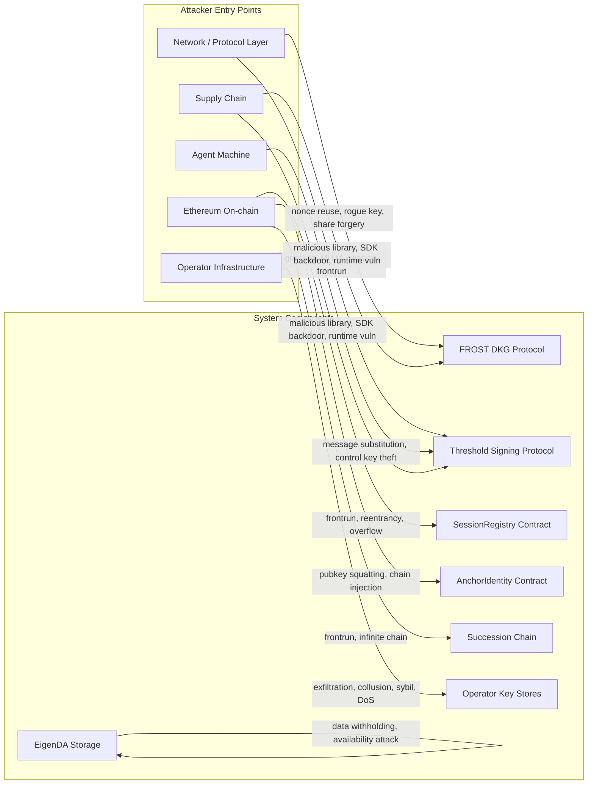

# Threat Model

HashID is a distributed key custody system for agent identity. An agent's Ed25519 signing key is never held by any single party — it is split via FROST DKG (RFC 9591) across a set of EigenLayer AVS operators using a K-of-N (ceil(N x 2/3)) threshold. Signing requires coordinated participation of a supermajority of sampled operators. Verification sessions are anchored on-chain in `SessionRegistry`; identity records are stored in EigenDA with on-chain commitment in `AnchorIdentity`.

This threat model covers the full attack surface: the FROST DKG and signing protocols, the operator infrastructure, the on-chain contracts (`SessionRegistry`, `AnchorIdentity`), the EigenDA storage layer, the key succession chain, and the supply chain of critical dependencies. It assumes a rational, well-resourced adversary but does not model nation-state-level compromise of the underlying Ethereum chain itself.

---

## Attack Surface Summary

---

## Threat Categories

### 1. Cryptographic / Protocol

---

### T-001: FROST Nonce Reuse Leading to Private Key Share Recovery

- **Category**: Cryptographic
- **Attacker**: Passive network observer or compromised operator node
- **Prerequisite**: Ability to observe two partial signatures from the same operator, both using the same nonce pair `(d, e)` but over different messages
- **Attack**: RFC 9591 Section 7.3 documents this attack precisely. In FROST, each partial signature has the form `z_i = d_i + e_i * rho_i + lambda_i * s_i * c`, where `(d_i, e_i)` are the nonce scalars and `s_i` is the secret share. If `(d_i, e_i)` are identical across two signing rounds for messages `m` and `m'`, the attacker obtains two equations `z_i` and `z_i'` that differ only in their challenge scalar `c` vs `c'`. Subtracting yields `z_i - z_i' = lambda_i * s_i * (c - c')`. Since `lambda_i` (Lagrange coefficient) and both challenges are fully public, the attacker solves for `s_i` directly.
- **Impact**: Full recovery of operator `i`'s FROST key share. With enough shares recovered (>= K), the group private key can be reconstructed and the agent's identity is permanently forged.
- **Current mitigation**: The design (design.md, threshold-signing/spec.md) mandates fresh CSPRNG-derived nonces per signing request. Nonce reuse is listed as a slashable condition. The agent logs signed nonce commitments `(operator_id, D_i, E_i, signature)` across sessions and can detect reuse.
- **Gap / Recommendation**: The spec states nonce reuse is "detectable" but does not specify the detection mechanism or the on-chain slashing path. The coordinator must maintain a per-operator log of emitted nonce commitments and enforce that no commitment is recycled. This log should be written to a tamper-evident store. The slashing condition must be encoded in the AVS contract and audited before mainnet. Operators should use deterministic nonce derivation as a defense-in-depth measure (RFC 9591 Appendix B: derive nonces from HMAC(secret_share, message)), ensuring that even a buggy CSPRNG that returns repeated values cannot produce two different messages with the same nonce.
- **Severity**: Critical

---

### T-002: Rogue Key Attack During DKG Biasing the Group Public Key

- **Category**: Cryptographic
- **Attacker**: Malicious operator participating in DKG
- **Prerequisite**: Control of at least one operator seat in the DKG ceremony; ability to observe other operators' commitment broadcasts before publishing its own
- **Attack**: In plain Pedersen DKG, a malicious operator `j` observes the commitment constant terms `C_i[0]` broadcast by all other operators before sending its own. The group public key is `sum(C_i[0])`. Operator `j` can choose `C_j[0] = target_pubkey - sum(C_i[0] for i != j)`, forcing the group public key to be any value it chooses — including a key for which it knows the discrete log. This is the "rogue key" or "key cancellation" attack.
- **Impact**: Operator `j` knows the entire group private key from the start. No K-of-N threshold is needed — the attacker can forge signatures unilaterally.
- **Current mitigation**: The design states FROST DKG is "Pedersen DKG with a broadcast-and-verify round." RFC 9591 requires proof-of-knowledge (a Schnorr signature over the commitment constant term) to bind each operator to its declared contribution. This proof-of-knowledge makes the rogue key attack infeasible — operator `j` cannot craft `C_j[0]` to cancel other contributions without also producing a valid Schnorr proof for a key it controls.
- **Gap / Recommendation**: The spec (frost-dkg/spec.md) describes Feldman VSS commitments but does not explicitly require proof-of-knowledge over the constant term `C_i[0]`. This must be an explicit, tested requirement. The DKG implementation must verify the Schnorr proof-of-knowledge for every operator's commitment before proceeding to Round 2. Failure to verify is not detectable by VSS checks alone — VSS only verifies share consistency, not the binding of the constant term. Add a test scenario in the DKG spec: "Operator with invalid proof-of-knowledge is rejected before Round 2 begins."
- **Severity**: Critical

---

### T-003: Feldman VSS Share Forgery Bypassing Verification

- **Category**: Cryptographic
- **Attacker**: Malicious operator participating in DKG
- **Prerequisite**: Control of one operator seat; ability to send different shares to different recipients
- **Attack**: A malicious operator `j` sends a syntactically valid share to operator `i` that passes the Feldman VSS check (`s_j(i) * G == sum(C_j[k] * i^k for k)`) but uses a different polynomial than the one committed to in Round 1. Specifically, `j` constructs a share that is individually consistent with its published commitments but inconsistent with the shares it sends to other operators — resulting in a group key that operator `j` can later reconstruct with fewer than K cooperating shares because its contribution is structured to embed a backdoor.
- **Impact**: Operator `j` learns the group private key after the ceremony, or is able to forge signatures with only the shares it controls, undermining the K-of-N guarantee.
- **Current mitigation**: Feldman VSS commitments bind each operator's polynomial. If operator `j` sends different shares to different operators that each individually verify, the inconsistency is not directly detectable without comparing shares — which operators do not do with each other's shares in the standard protocol.
- **Gap / Recommendation**: This is a subtle but known class of attack. The mitigation is to require operators to publish commitments to the entire polynomial (all K coefficients) in Round 1, and to verify that the product of commitment terms matches across all received shares. Additionally, consider requiring operators to publish a zero-knowledge proof that their polynomial was generated honestly (e.g., a range proof or a commitment to the polynomial evaluation). At minimum, the audit scope for the AVS contract must include verification that the coordinator enforces consistency of commitments across rounds and that complaint handling is correctly implemented.
- **Severity**: High

---

### T-004: Partial Signature Grinding to Reconstruct a Key Share

- **Category**: Cryptographic
- **Attacker**: Passive observer with long-term access to partial signature traffic, or compromised operator node
- **Prerequisite**: Ability to collect partial signatures from the same operator `i` across many independent signing sessions; knowledge of corresponding messages and nonce commitments
- **Attack**: Each partial signature `z_i` is a linear function of the secret share `s_i`. Across multiple sessions, the attacker collects `(z_i, c, lambda_i, nonce_commitment)` tuples. While FROST's per-request nonce generation means these equations are not directly solvable (each uses a fresh nonce, adding a new unknown), an attacker with compromised operator infrastructure could record the nonce scalars `(d_i, e_i)` at generation time. With those nonces in hand, each signing equation is a direct linear equation in `s_i` — one session is sufficient to solve for the share.
- **Impact**: Recovery of the share for operator `i` without direct access to the operator's secure storage, leveraging network-layer access or compromised operator infrastructure.
- **Current mitigation**: Nonces are deleted immediately after use per RFC 9591. Each partial signature uses fresh random nonces, so without knowing the nonce scalars an observer cannot recover the share from the partial signature alone.
- **Gap / Recommendation**: The spec does not specify nonce deletion guarantees. Operators must explicitly zero nonce scalars `(d_i, e_i)` from memory after the partial signature is computed, before any network transmission. This must be a requirement in the threshold-signing spec with a corresponding test that verifies nonces are not recoverable from operator memory after a signing round. Additionally, partial signatures must not be logged in plaintext by the coordinator — only aggregated output should be retained.
- **Severity**: High

---

### T-005: VRF Seed Bias or Grinding to Control Operator Sampling

- **Category**: Cryptographic
- **Attacker**: Block proposer or attacker with influence over the `initSession` block
- **Prerequisite**: Ability to influence the on-chain VRF seed — either via block proposer slot manipulation or via reorgs
- **Attack**: If the VRF seed could be biased by the block proposer (controlling `block.prevrandao`), an attacker can grind nonces until the VRF output maps to an operator set that is predominantly under their control. Even with a 2/3 threshold, if the attacker controls 7 of 10 sampled operators, they can forge a signature for that session. With a block proposer on Ethereum PoS, the proposer can withhold a block and try again to bias the seed.
- **Impact**: Attacker can selectively forge signatures for specific sessions where their operator set is sampled, without needing to control more than K operators globally.
- **Current mitigation**: Per-session VRF operator sampling uses `keccak256(session_id || session.vrf_randao)` where `session.vrf_randao` is `block.prevrandao` from the `initSession` block — beacon-chain RANDAO randomness that is unpredictable before the block is produced. The VRF output is independently verifiable by any party from on-chain data. No external coordinator supplies any component of the seed.
- **Gap / Recommendation**: The remaining window is block-proposer bias: a validator who is the block proposer for the `initSession` block can withhold the block and retry to bias `prevrandao`. This requires controlling a validator slot, which is economically constrained by the consensus layer's slashing rules. Consider requiring a 1-block delay before operators must acknowledge (the current 2-minute acknowledgment window provides a practical buffer). The per-operator concentration limit `N - K` further limits the damage if seed bias is achieved for a single session.
- **Severity**: High

---

### 2. Key Material

---

### T-006: Operator Infrastructure Breach Exfiltrating a Key Share

- **Category**: Key Material
- **Attacker**: External attacker or malicious insider with access to an operator's host
- **Prerequisite**: Compromise of one or more operator hosts via OS vulnerability, stolen credentials, or supply chain attack
- **Attack**: The attacker gains shell or filesystem access to an EigenLayer AVS operator node and reads the FROST key share from disk (database, file, or in-memory process dump). With K shares from K different operators (K = ceil(N x 2/3)), the attacker reconstructs the group private key by evaluating the Lagrange interpolation of the shares.
- **Impact**: Permanent, undetectable impersonation of the agent. All future verifications can be forged without detection.
- **Current mitigation**: The design states shares must be in "secure, persistent storage, protected by the operator's own access controls." EigenLayer slashing provides an economic disincentive. FROST resharing allows proactive share rotation before compromise becomes viable.
- **Gap / Recommendation**: "Secure storage" is undefined in the spec. Operators should be required to: (1) store shares encrypted at rest using a key held in a HSM or operator-controlled KMS with audit logging; (2) enforce operator-level access controls such that no single administrator account can read all shares; (3) implement memory protection for in-process share material (mlock, guard pages). The AVS registration contract should require operators to attest to their security posture. Epoch-based proactive resharing (ProactiveSS) should have a defined maximum epoch duration — shares older than one epoch should be considered high-risk.
- **Severity**: Critical

---

### T-007: Agent Machine as Implicit Trust Anchor via Partial Signature Aggregation

- **Category**: Key Material
- **Attacker**: Attacker who fully compromises the agent machine (hashid-cli process)
- **Prerequisite**: Full control of the agent process and its network traffic
- **Attack**: The agent is the FROST coordinator for its own signing sessions — it contacts operators directly, collects partial signatures, and aggregates them. A compromised agent sees all K partial signatures `{z_1, ..., z_K}` for the same message and the corresponding nonce commitments. As analyzed in T-004, with nonce scalars known at the operator, the partial signatures alone are linear equations in the shares. Additionally, the agent can substitute the message being signed (see T-013).
- **Impact**: A compromised agent machine is the most powerful single-point attack — it can attempt share recovery via nonce correlation, forge signing requests, and silently substitute messages. It does not directly reconstruct the key from partial sigs in the honest-nonce case, but its position makes it a high-value target.
- **Current mitigation**: The challenge pre-commitment scheme (H-3) requires the verifier to commit `challenge_hashes: bytes32[5]` on-chain at `initSession`. Operators verify that the message they are asked to sign matches the committed challenge hashes before generating nonce material. This prevents a compromised agent from routing arbitrary messages to operators — any substitution is detectable and rejected. Operators verify session existence on-chain before signing. The agent does not hold any FROST key shares.
- **Gap / Recommendation**: The control key (held by the agent machine) remains a single point of trust for authorizing signing requests. If the control key is stolen, the attacker can issue valid auth tokens. Rate limiting (60 requests/hour per agent) bounds the damage window. Standalone control key rotation (commit-reveal + K-of-N endorsement) provides recovery. The two-factor design — K-of-N operator shares AND agent control key — means neither factor alone is sufficient.
- **Severity**: High

---

### T-008: Targeted K-Operator Collusion to Forge Signatures

- **Category**: Key Material
- **Attacker**: Coalition of K or more operators
- **Prerequisite**: Social or economic coordination of at least K (ceil(N x 2/3)) operators
- **Attack**: K operators cooperate outside the protocol. They reconstruct the group private key by pooling their shares (standard Lagrange interpolation over the elliptic curve scalars) and thereafter forge arbitrary signatures for the agent without the agent's involvement or knowledge.
- **Impact**: Permanent, undetectable impersonation. All future verifications are forgeable.
- **Current mitigation**: The 2/3 supermajority threshold (BFT-standard) makes this require collusion of the majority. EigenLayer slashing penalizes detected misbehavior. VRF per-session sampling varies which operators are exposed to each session.
- **Gap / Recommendation**: The economics of collusion depend heavily on the slash amount vs. the value of forging an identity. The AVS contract must set slash amounts that exceed the expected profit from any realistic attack. The design notes "expanded slashing conditions post-audit" — collusion (equivocation or co-signing outside a registered session) must be a first-class slashable condition from day one, not deferred. Monitoring for anomalous co-signing patterns (same K operators repeatedly sampled together) should be implemented as an off-chain alerting layer.
- **Severity**: High

---

### T-009: Sybil Operator Registration to Accumulate Shares

- **Category**: Key Material
- **Attacker**: Single entity registering multiple operators in the EigenLayer AVS
- **Prerequisite**: Sufficient restaked ETH to register N entities as distinct AVS operators; ability to pass any operator identity checks
- **Attack**: If operator identity is not distinct and independently verified, one entity registers N operator nodes with distinct keys. During DKG, all N shares are distributed to effectively one controller. Any K of those shares yield the group private key.
- **Impact**: The K-of-N threshold provides no protection. One entity can forge signatures immediately after DKG.
- **Current mitigation**: EigenLayer operator registration requires staked ETH — a Sybil creates economic cost. The design references "EigenLayer's full active operator set" as the genesis set, implying existing independently-operated nodes.
- **Gap / Recommendation**: The AVS contract enforces a maximum concentration limit — no single Ethereum address may control more than `N - K` of the total operator seats. This is checked on-chain at `DKGInit` time using the operator's registered withdrawal address, signing key, and known delegation relationships. Operators should also demonstrate distinct infrastructure attestations (e.g., distinct IP ranges). The genesis operator selection should be documented with explicit diversity criteria.
- **Severity**: High

---

### T-010: Share Persistence After Resharing Enabling Retrospective Key Recovery

- **Category**: Key Material
- **Attacker**: Attacker with delayed access to an operator's historical storage (backup, disk image, cold storage)
- **Prerequisite**: Access to pre-resharing storage media (e.g., a backup snapshot, a decommissioned disk, a memory dump taken before resharing)
- **Attack**: After FROST resharing (ProactiveSS), old shares are supposed to be "cryptographically invalidated." However, if an operator retains a backup or does not securely wipe old share material, an attacker who later gains access to that historical data recovers the old share. If K old shares from the same epoch are recovered, the group private key for that epoch is reconstructed. Signatures produced before the resharing epoch are valid against the same group public key (which does not change).
- **Impact**: Retroactive key recovery enabling forgery of all past and future verifications (same group public key).
- **Current mitigation**: The key-succession spec states old shares must be deleted after resharing. The frost-dkg spec confirms old shares are invalid after resharing. No specification of deletion procedures exists.
- **Gap / Recommendation**: "Cryptographically invalidated" must mean more than "the new epoch's shares won't accept the old ones." The operator must: (1) securely overwrite share material with random bytes before releasing memory/storage (zero then random write); (2) explicitly delete all backups of the pre-resharing share; (3) log the deletion with a signed attestation submitted to the coordinator. The AVS contract should accept deletion attestations as part of the resharing ceremony completion. Failure to attest deletion within an epoch window should be a slashable condition.
- **Severity**: High

---

### 3. Session Layer

---

### T-011: Session Frontrunning to Hijack a Legitimate Session Nonce

- **Category**: Session Layer
- **Attacker**: Network observer or Ethereum mempool watcher
- **Prerequisite**: Ability to observe `initSession` transactions in the mempool before they are mined; ability to submit competing transactions with higher gas
- **Attack**: A legitimate verifier submits `initSession(agent_pubkey, nonce, verifier_pubkey)` to the mempool. An attacker observing the mempool extracts the nonce and front-runs the transaction with a call from their own (registered, bonded) verifier address using the same nonce. If the contract uses the nonce as a deduplication key without tying it to the verifier address, the attacker's session is created first and the legitimate verifier's call reverts with "nonce-already-used."
- **Impact**: Denial-of-service against specific verifiers on a per-session basis. If the nonce is verifier-scoped, the impact is limited; if global, any verifier's session can be blocked.
- **Current mitigation**: The on-chain-session spec requires "duplicate nonce is rejected when a verifier calls initSession with a nonce already used in a prior session for the same agent" — the nonce check appears to be scoped to `(verifier, agent)` pairs, limiting frontrun impact.
- **Gap / Recommendation**: Confirm and enforce that nonce uniqueness is enforced per `(verifier_pubkey, agent_pubkey)` pair, not globally. Even with this scoping, an attacker who has registered as a verifier can front-run and waste the legitimate verifier's session slot (occupying one of their 10 slots). To mitigate, consider commit-reveal nonce submission: the verifier commits a hash of the nonce first, then reveals it in a subsequent block, eliminating the mempool observation window.
- **Severity**: Medium

---

### T-012: Session Exhaustion Denial-of-Service Against the Operator Network

- **Category**: Session Layer
- **Attacker**: Attacker with minimal capital (enough to register as a verifier and post the minimum bond)
- **Prerequisite**: On-chain registration as a verifier with a minimum bond; ability to issue automated `initSession` calls
- **Attack**: A registered verifier fills all 10 of their permitted open sessions with requests for a target agent, then never submits valid signatures, holding the sessions open for the full 30-minute expiry window. If the attacker registers many verifier identities (each requiring only the minimum bond), they can open 10 x M sessions across M identities, exhausting the on-chain state and forcing operators to evaluate session validity for all of them on every signing request. This increases coordinator lookup load and can push legitimate sessions out of the expiry window.
- **Impact**: Denial-of-service against specific agents; increased on-chain storage costs; operator workload from evaluating spurious session requests.
- **Current mitigation**: Per-verifier rate limit of 10 open sessions enforced by `SessionRegistry`. Verifier bond requirement raises the economic cost of registration.
- **Gap / Recommendation**: The bond amount must be set high enough that opening 10 sessions x M verifiers is economically costly relative to the disruption caused. Bond should be slashable on evidence of session abuse (opening sessions that are never spent or consistently expire). Rate limiting should also apply per `(verifier, agent)` pair to prevent targeted agent exhaustion. Consider a per-session fee (burned or distributed to operators) that makes session spam economically irrational.
- **Severity**: Medium

---

### T-013: Agent Machine Message Substitution

- **Category**: Session Layer
- **Attacker**: Compromised agent machine (hashid-cli process)
- **Prerequisite**: Full control of the agent process and its network traffic
- **Attack**: Because the agent is the FROST coordinator for its own signing sessions, a compromised agent machine could substitute the challenge with an attacker-controlled payload `m'` before routing it to operators. Without an on-chain commitment, operators verify only that `session_id` is open on-chain, not that the message matches what the verifier intended. They produce partial signatures over `m'`, which the agent aggregates into a valid Ed25519 signature over a message the verifier never committed to.
- **Impact**: The compromised agent can coerce the operator set into signing arbitrary content under the agent's key, as long as it can present a valid open session.
- **Current mitigation**: The challenge pre-commitment scheme is implemented: `initSession` accepts `challenge_hashes: bytes32[5]`. Operators verify `keccak256(raw_challenge) ∈ session.challenge_hashes` and `sha256(raw_challenge || session_id) == message` before generating any nonce material. Any substitution causes operator rejection before nonce commitments are produced. The agent also verifies the assembled signature locally before returning it to the verifier.
- **Gap / Recommendation**: The current spec fully addresses this threat. Operator rejection receipts provide audit evidence when a compromised agent attempts substitution. The two-factor requirement (operator participation + control key) means a compromised agent machine that does not also have the control key cannot produce valid auth tokens for new signing sessions.
- **Severity**: High

---

### T-014: Challenge Pre-computation After Key Recovery

- **Category**: Session Layer
- **Attacker**: Attacker who has recovered the full group private key (via T-001, T-006, or T-008)
- **Prerequisite**: Full group private key in hand
- **Attack**: Challenges are arbitrary verifier-chosen strings. There is no fixed corpus. However, an attacker who has recovered the full group private key can answer any future challenge set without operator participation by computing `sign(sha256(challenge || session_id), group_privkey)` directly.
- **Impact**: If the key is recovered, no live interaction with operators is needed for future verifications — the attacker can answer any session instantly.
- **Current mitigation**: The `session_id` is bound into each signed message, meaning signatures are session-specific and cannot be replayed across sessions. The verifier chooses fresh arbitrary challenges per session, preventing pre-computation of a static table. Key recovery itself requires compromising K-of-N operator shares simultaneously.
- **Gap / Recommendation**: The session binding prevents replay. The protection against pre-computation is the key custody guarantee — if K shares are compromised, key rotation (succession) is the appropriate response. Proactive resharing limits the window of any single share's exposure.
- **Severity**: Low

---

### T-015: Session ID Oracle via Predictable Session ID Generation

- **Category**: Session Layer
- **Attacker**: Passive observer or network attacker
- **Prerequisite**: Ability to observe historical session IDs and identify the generation pattern
- **Attack**: If `session_id` is generated deterministically from inputs observable to an attacker (e.g., sequential counter, block number, or a hash of public inputs like `(verifier_pubkey, agent_pubkey, nonce)` where the nonce is predictable), the attacker can enumerate valid session IDs and probe on-chain state for open sessions. This can be combined with T-013 (agent-machine message substitution) to intercept specific sessions or to monitor which agents are being verified at what times.
- **Impact**: Privacy leak of agent verification activity; enables targeted attacks against specific open sessions.
- **Current mitigation**: Session IDs are returned by `initSession` and are presumably derived from a hash of inputs. The nonce is caller-provided, adding entropy.
- **Gap / Recommendation**: `session_id` must be derived as `keccak256(verifier_pubkey || agent_pubkey || nonce || block_hash)` where `block_hash` is the hash of the block containing the `initSession` transaction. This makes session IDs unpredictable to observers watching the mempool but verifiable on-chain. Document the exact session ID derivation formula in the on-chain-session spec.
- **Severity**: Low

---

### 4. Smart Contract

---

### T-016: Reentrancy in SessionRegistry.spend Enabling Double Spend or State Corruption

- **Category**: Smart Contract
- **Attacker**: Attacker controlling a contract registered as a verifier
- **Prerequisite**: Verifier is a smart contract (rather than an EOA) with a fallback function
- **Attack**: The `spend` (or `SubmitVerification`) function in `SessionRegistry` transitions a session from OPEN to SPENT. If state mutation occurs after an external call (e.g., a call to the verifier contract to notify it of session completion, or a token transfer to refund bond), a malicious verifier contract re-enters `spend` before the state update, spending the same session twice. In the most dangerous variant, re-entering `spend` on a second session (not the same one) that relies on the first session's state could corrupt rate-limit accounting.
- **Impact**: Double-spend of a session nonce (enabling a replayed signature to be submitted twice), corruption of per-verifier session counters, potential bond theft.
- **Current mitigation**: Not explicitly addressed in the spec.
- **Gap / Recommendation**: Apply the checks-effects-interactions pattern: mark the session as SPENT and update all accounting state before any external calls or token transfers. Additionally, implement a reentrancy guard (`nonReentrant` modifier from OpenZeppelin) on all state-mutating session functions. This must be verified in the contract audit.
- **Severity**: High

---

### T-017: AnchorIdentity Frontrunning to Register a Victim's Public Key First

- **Category**: Smart Contract
- **Attacker**: Mempool observer with sufficient gas budget
- **Prerequisite**: Ability to observe `AnchorIdentity` calls in the mempool and extract `threshold_pubkey` and `db_commitment` before they are mined
- **Attack**: A legitimate agent completes FROST DKG, builds its identity record, and calls `AnchorIdentity(threshold_pubkey, eigenda_record_id, db_commitment)`. An attacker monitoring the mempool extracts the pubkey and parameters, then submits the same call with higher gas and a different `eigenda_record_id` pointing to an attacker-controlled EigenDA record. If the contract does not bind the anchor to the caller's identity or require the `db_commitment` to be a threshold signature under `threshold_pubkey`, the attacker anchors a fake identity under the legitimate agent's public key.
- **Impact**: The attacker registers the agent's public key to their own EigenDA record with a `db_commitment` they control. All verifiers looking up the agent by pubkey receive the attacker's record.
- **Current mitigation**: The spec defines `db_commitment` as `sign(sha256(identity_record), private_key)` — the commitment is a threshold signature under `threshold_pubkey`. This means an attacker who front-runs must also produce a valid threshold signature over their fake record, which requires K operator cooperation.
- **Gap / Recommendation**: Confirm that the `AnchorIdentity` contract on-chain verifies `ed25519.verify(db_commitment, sha256(identity_record), threshold_pubkey)` at registration time, not just stores the values. If verification is off-chain only, frontrunning with a malformed commitment is trivially possible. The on-chain verification of `db_commitment` at anchor time is load-bearing and must be an audited contract requirement.
- **Severity**: High

---

### T-018: Succession Chain Injection via Forged Succession Entry

- **Category**: Smart Contract
- **Attacker**: Attacker who has temporarily compromised the old key (or its shares)
- **Prerequisite**: Ability to produce a threshold signature under the old key (requires K old shares — same bar as T-008)
- **Attack**: Before the legitimate agent files a succession entry pointing to a new key it controls, the attacker produces a valid threshold signature over `{ new_pubkey: attacker_key, timestamp, reason }` and submits it as a succession entry on-chain. Since the succession chain is append-only and the entry is signed by the old key, the contract accepts it. The agent's chain now points to the attacker's key.
- **Impact**: Permanent redirection of the agent's identity to an attacker-controlled key. All future verifiers following the chain will authenticate to the attacker.
- **Current mitigation**: Succession requires a valid threshold signature under the old key, meaning the attacker must already control K shares. The chain is append-only, so a fraudulent entry cannot be retracted.
- **Gap / Recommendation**: Since a succession entry can only be created with K shares (same requirement as forging a signature), the threat is real only if the attacker already has enough shares. To limit the damage window: (1) implement a time-lock on succession entries — a pending succession must be observable on-chain for a minimum challenge window (e.g., 24 hours) before it becomes active, during which the legitimate agent can contest by filing a counter-succession or triggering an emergency protocol; (2) require the new key to demonstrate possession at succession time (sign a challenge under the new key as part of the succession transaction). Neither mitigation eliminates the attack if K shares are already compromised, but they provide detection and response time.
- **Severity**: High

---

### T-019: Bond Griefing and False Slash Manipulation

- **Category**: Smart Contract
- **Attacker**: Attacker with a registered verifier identity
- **Prerequisite**: Registered verifier; knowledge of a target verifier's open sessions or bond amount
- **Attack**: If the slashing logic in `SessionRegistry` can be triggered by on-chain conditions that an attacker can fake or provoke (e.g., submitting a signature that is invalid for a legitimate session, framing it as the target verifier's submission), the attacker causes the contract to slash the target's bond. Alternatively, if session expiry itself triggers bond reduction, the attacker can deliberately prevent sessions from closing (by front-running session spending transactions or attacking the agent) to force bond depletion.
- **Impact**: Economic attack draining a legitimate verifier's bond, disqualifying them from the system.
- **Current mitigation**: Not explicitly addressed in the spec. The spec describes a verifier bond requirement but does not detail slash triggers.
- **Gap / Recommendation**: Slashing must be callable only by the AVS contract itself based on cryptographically verifiable evidence (e.g., duplicate nonce proofs submitted on-chain), never by arbitrary external callers. The slash conditions, the evidence format, and the verification logic must be audited before mainnet. Bond reductions due to expired sessions must not occur — expiry is a normal operational condition, not misbehavior.
- **Severity**: Medium

---

### T-020: Integer Overflow or Underflow in Rate Limit Accounting

- **Category**: Smart Contract
- **Attacker**: Any caller who can open or close sessions
- **Prerequisite**: A Solidity version or arithmetic path that allows integer wrap-around in session counter tracking
- **Attack**: If the per-verifier open session counter is stored as a `uint256` (or smaller integer) and the decrement path on session expiry or spend is not guarded against underflow, an attacker who triggers rapid open/close/expire cycles may underflow the counter to `type(uint256).max`, bypassing the rate limit entirely and opening unlimited sessions.
- **Impact**: Complete bypass of the per-verifier 10-session rate limit; unlimited session creation enabling T-012 at no additional cost.
- **Current mitigation**: Not explicitly addressed. Solidity 0.8+ provides checked arithmetic by default.
- **Gap / Recommendation**: Use Solidity 0.8+ to get built-in overflow protection. Add explicit bounds checks on session counter decrements — decrement only when `counter > 0`. Implement property-based tests (invariant tests using Foundry's `invariant_` framework) asserting that the open session counter for any verifier is always between 0 and 10 inclusive after any sequence of operations.
- **Severity**: Medium

---

### 5. Infrastructure / Availability

---

### T-021: Targeted DoS on VRF-Sampled Operators After Seed Reveal

- **Category**: Infrastructure / Availability
- **Attacker**: Network-layer attacker who can perform DDoS
- **Prerequisite**: Knowledge of the VRF seed and sampling algorithm at the start of a signing session; ability to perform targeted UDP/TCP flood against operator IPs
- **Attack**: Once the VRF seed for a session is revealed (either by the on-chain block or the coordinator), an attacker who knows the sampling algorithm can compute exactly which K operators will be selected. The attacker then DDoSes those K operators before they can respond within the 5-minute window. With all K operators unreachable, the signing request expires and the agent must retry. If the VRF seed is predictable (see T-005) or the attacker has advance knowledge of seeds, they can do this for every session.
- **Impact**: Indefinite denial-of-service against a specific agent's ability to produce signatures.
- **Current mitigation**: The design acknowledges this: "random per-session sampling means the attacker must compromise a supermajority of the full operator set simultaneously." The 5-minute window allows retry with a fresh VRF sample.
- **Gap / Recommendation**: The mitigation is only effective if operator IPs are not all publicly discoverable. Operators register public HTTPS endpoint URLs in the on-chain registry — these are necessarily public. Operator endpoints should therefore be protected behind DDoS-mitigation infrastructure (e.g., Cloudflare, AWS Shield). The agent automatically resamples a new operator set on signing request timeout without requiring a full session restart, within the 5-minute signing window.
- **Severity**: Medium

---

### T-022: Agent Machine Unavailability Blocking Signing

- **Category**: Infrastructure / Availability
- **Attacker**: DoS attacker or infrastructure failure targeting the agent machine
- **Prerequisite**: Ability to make the agent process (hashid-cli) unavailable
- **Attack**: The agent machine is the coordination point for signing — it contacts operators directly, collects partial signatures, and aggregates them. If the agent machine is unreachable or crashed, no signing sessions can be initiated or completed regardless of operator availability.
- **Impact**: Loss of signing capability while the agent is down. Active sessions may expire if the agent is offline during the signing window.
- **Current mitigation**: Unlike a centralized coordinator service, there is no shared coordination state to replicate — the agent is simply the client process. The agent can be restarted and will re-read operator endpoints from the on-chain registry. Any incomplete sessions can be retried.
- **Gap / Recommendation**: Operators with high availability requirements should run the agent process in a supervised environment (systemd, Kubernetes) with automatic restart. Since the agent holds no key material and reads operator endpoints from the chain, restart is fast and stateless. The primary availability concern is the agent machine's control key storage — if the machine hosting the control key is permanently lost, standalone control key rotation via K-of-N endorsement is the recovery path.
- **Severity**: Medium

---

### T-023: EigenDA Data Withholding Preventing Identity Record Reads

- **Category**: Infrastructure / Availability
- **Attacker**: EigenDA operator set (majority colluding) or network attacker
- **Prerequisite**: Control of a sufficient fraction of EigenDA operators to withhold data availability for specific records; or targeted network attack against EigenDA retrieval endpoints
- **Attack**: Verifiers fetch the agent's identity record from EigenDA using `eigenda_record_id`. If EigenDA operators refuse to serve the record (data withholding attack), verifiers cannot retrieve the record and cannot proceed with verification even though the on-chain anchor exists and is valid.
- **Impact**: Denial-of-service against any agent whose EigenDA record is withheld. Verification is impossible.
- **Current mitigation**: The design notes: "on-chain commitment allows verifiers to detect stale/absent data; operator slashing creates availability incentives." The on-chain `db_commitment` allows verifiers to detect tampering but does not help if the record is simply unavailable.
- **Gap / Recommendation**: Implement a fallback retrieval path: the identity record (which is not secret — it contains the public key, commitment, and metadata) should be cached by the CLI and optionally published to a secondary availability layer (IPFS or Arweave) at bootstrap time. The on-chain `db_commitment` allows verifiers to authenticate the record regardless of retrieval source. This fallback is acceptable because the record's integrity is verified on-chain, not by EigenDA itself.
- **Severity**: Medium

---

### T-024: Long-Range Availability Attack Coordinating Operator Downtime Across Resharing Epoch

- **Category**: Infrastructure / Availability
- **Attacker**: Attacker who can coordinate simultaneous downtime of a majority of operators
- **Prerequisite**: Ability to shut down or disconnect > N - K + 1 operators simultaneously, spanning the entire resharing epoch
- **Attack**: During a FROST resharing ceremony, old shares are invalidated and new shares must be distributed. If a sufficient number of operators are offline during the resharing ceremony, the ceremony cannot complete. If the old shares are then deleted by honest operators (per the spec requirement), and fewer than K operators have successfully received new shares, the key is permanently lost — no threshold can be formed with either old (deleted) or new (incomplete) shares.
- **Impact**: Permanent loss of the agent's private key. The identity is effectively destroyed and cannot be recovered.
- **Current mitigation**: Not explicitly addressed. The design mentions resharing requires all N operators for ceremony participation.
- **Gap / Recommendation**: Resharing ceremonies must have a two-phase commit: old shares must not be deleted until the new share distribution is confirmed complete across all N operators with a verifiable acknowledgment. If the ceremony fails (insufficient operators), the old shares must remain valid and the ceremony must be retried. Define a minimum operator availability threshold for initiating resharing (e.g., all N operators must be online and responsive before the ceremony begins). Implement a health check gate in the coordinator before initiating any resharing.
- **Severity**: High

---

### 6. Identity & Succession

---

### T-025: Bootstrap Race and Public Key Squatting

- **Category**: Identity & Succession
- **Attacker**: Attacker monitoring for DKG completions and `AnchorIdentity` mempool transactions
- **Prerequisite**: Ability to observe the mempool for `AnchorIdentity` calls; ability to front-run with higher gas (same mechanics as T-017)
- **Attack**: Two independent agents run DKG ceremonies that happen to produce the same group public key (probabilistically negligible for 256-bit Ed25519, but the real risk is deliberate: an attacker who has compromised the coordinator during DKG biases the output per T-002). The attacker uses this knowledge to front-run the legitimate agent's `AnchorIdentity` call and register the key with a fake EigenDA record. The legitimate agent's `AnchorIdentity` call then reverts because the key is already registered.
- **Impact**: The legitimate agent cannot register its identity. The attacker holds the on-chain anchor for the agent's key.
- **Current mitigation**: `db_commitment` is a threshold signature under `threshold_pubkey` — the attacker must produce a valid threshold signature to register a fake anchor. This requires K operator cooperation (same bar as T-017).
- **Gap / Recommendation**: The `AnchorIdentity` contract must enforce that each `threshold_pubkey` can be anchored at most once (no re-registration). If the contract verifies `db_commitment` as a threshold signature at registration time (per T-017 recommendation), squatting is infeasible for an attacker who does not control K shares. Confirm that first-registration semantics are enforced and that re-registration reverts.
- **Severity**: Medium

---

### T-026: Succession Chain Frontrunning After Key Compromise

- **Category**: Identity & Succession
- **Attacker**: Attacker who has obtained K shares of the compromised key
- **Prerequisite**: K shares of the currently active key; ability to observe the agent's succession transaction in the mempool
- **Attack**: The legitimate agent discovers its key is compromised and initiates a succession ceremony to a new key. It submits `{ new_pubkey: agent_new_key, signature: threshold_sig_under_old_key }` to `AnchorIdentity`. An attacker who also has K shares observes this in the mempool, extracts the format, and submits their own succession entry `{ new_pubkey: attacker_key, signature: threshold_sig_under_old_key }` with higher gas. The attacker's entry is mined first, pointing the chain to the attacker's key.
- **Impact**: The agent's identity chain permanently points to an attacker-controlled key. Legitimate succession is blocked.
- **Current mitigation**: Not explicitly addressed.
- **Gap / Recommendation**: Use a commit-reveal scheme for succession: in block N, commit `keccak256(new_pubkey || salt)`; in block N+K (after some minimum delay), reveal `new_pubkey || salt || signature`. The commit phase is a hash — an attacker watching the mempool cannot extract `new_pubkey` from the commitment. Only the revealing party (who knows `salt`) can complete the succession. The contract must enforce that only the committing address can reveal.
- **Severity**: High

---

### T-027: Infinite Succession Chain Growth via Forced Frequent Rotations

- **Category**: Identity & Succession
- **Attacker**: Attacker who can trigger repeated key compromise incidents or spam succession entries
- **Prerequisite**: Ability to compromise individual operator shares repeatedly (forcing resharing), or to submit valid succession entries rapidly if they have recurring key access
- **Attack**: Each succession event appends a new entry on-chain. If an attacker can force frequent rotations (by triggering compromise detections, forcing resharing failures, or directly producing succession entries if they have intermittent K-share access), the chain grows unboundedly. Verifiers who must walk the entire chain from genesis pay increasing gas costs and latency. A chain of length L costs O(L) RPC calls to traverse.
- **Impact**: Verifier chain traversal becomes prohibitively expensive, effectively denying service to legitimate verifiers.
- **Current mitigation**: Chain traversal is expected to be short; verifiers cache the current key with TTL.
- **Gap / Recommendation**: The `AnchorIdentity` contract must enforce a minimum time between successive succession entries for the same `agent_pubkey` (e.g., no more than one succession per 24 hours). Implement a maximum chain length (e.g., 100 entries), after which a new genesis registration is required. Verifiers should use the latest confirmed succession as a cached root and only re-walk on cache miss, not on every verification.
- **Severity**: Low

---

### T-028: Verifier Cache Poisoning Causing Stale Public Key Usage

- **Category**: Identity & Succession
- **Attacker**: Attacker who can influence a verifier's cache or exploit TTL-based staleness
- **Prerequisite**: A verifier that caches the agent's current public key with a fixed TTL; knowledge of a pending succession event that changes the key
- **Attack**: A verifier caches `(agent_id → current_pubkey)` with a TTL of, say, 1 hour. The agent undergoes a legitimate succession (old key → new key) within that hour. The verifier continues to verify against the old public key. If the old key has been compromised, an attacker can present forged signatures that verify against the cached (but now invalidated) old key, and the verifier accepts them.
- **Impact**: Verifier incorrectly authenticates an attacker's forged signature using a superseded public key.
- **Current mitigation**: The on-chain succession chain is authoritative. Verifiers are expected to "re-walk on cache miss." The architecture doc notes "verifiers cache the current key with TTL."
- **Gap / Recommendation**: The cache TTL must be short enough to bound the window of exposure after a succession. Implement an on-chain event (`SuccessionPublished(agent_pubkey, new_pubkey, timestamp)`) and require verifier implementations to subscribe to these events and invalidate their cache immediately on receipt. The TTL should be a configurable maximum (e.g., 5 minutes), not an indefinite cache. Document the expected staleness bound in the verification protocol spec.
- **Severity**: Medium

---

### 7. Supply Chain

---

### T-029: Compromised @noble/curves Leaking Private Nonces or Biasing Randomness

- **Category**: Supply Chain
- **Attacker**: Attacker who has compromised the `@noble/curves` npm package (e.g., via a malicious publish, a typosquatting package, or a compromised maintainer account)
- **Prerequisite**: Ability to publish a malicious version of `@noble/curves` to the npm registry; agents and operators using `npm install` without pinning exact hashes
- **Attack**: A malicious version of `@noble/curves` is published. It modifies the FROST nonce generation to produce predictable nonces (e.g., derived from a known seed rather than CSPRNG), or leaks generated nonces to an attacker-controlled endpoint, or biases EdDSA signing to use weak randomness. Any of these directly enables T-001 (nonce reuse) or T-004 (share recovery from partial signatures).
- **Impact**: Silent compromise of the entire key custody system — all operator shares become recoverable from observed partial signatures. The attack is invisible at the protocol level.
- **Current mitigation**: The design cites `@noble/curves` as the chosen library specifically for being "pure TypeScript with no WASM or native bindings." This reduces some attack surface but not supply chain compromise.
- **Gap / Recommendation**: Pin exact versions and SHA-512 hashes of `@noble/curves` and all transitive cryptographic dependencies in `package.json` using `pnpm`'s lockfile integrity hashes. Verify the lockfile hash in CI. Implement a dependency audit step in CI (`pnpm audit --audit-level=critical`). For operators, build the operator software as a reproducible Docker image with a pinned lockfile — operators should not run `npm install` in production; they should deploy a pre-built, hash-verified image. Consider vendoring `@noble/curves` with an explicit review gate for upstream updates.
- **Severity**: Critical

---

### T-030: Compromised EigenLayer AVS SDK Routing to Attacker-Controlled Endpoints

- **Category**: Supply Chain
- **Attacker**: Attacker who has compromised the EigenLayer AVS SDK package
- **Prerequisite**: Ability to publish a malicious version of the EigenLayer AVS SDK; or ability to MITM the SDK's network calls if endpoints are not pinned
- **Attack**: A malicious AVS SDK version replaces operator endpoint URLs with attacker-controlled servers. Signing requests (including `message`, `session_id`, and any key material in transit) are routed to the attacker. Partial signatures are collected by the attacker instead of the agent. Additionally, the SDK could exfiltrate the agent's local state or forge operator responses.
- **Impact**: Complete control of the signing flow. The attacker receives all signing requests and partial signatures, enabling T-004. Agent receives forged (attacker-assembled) signatures.
- **Current mitigation**: Operators verify session existence on-chain independently. This provides a partial check but does not protect against a malicious SDK that routes correctly to operators but exfiltrates data.
- **Gap / Recommendation**: Pin the EigenLayer AVS SDK version in the lockfile. Operator endpoints are read from the on-chain registry by the agent — the SDK must not have the ability to override or substitute these endpoints from an untrusted source. TLS certificate verification for all operator communication should be enforced. The SDK's network calls should be audited for any telemetry, analytics, or callback URLs that could exfiltrate request data.
- **Severity**: High

---

### T-031: Node.js Runtime Vulnerability Enabling Memory Disclosure of Key Material

- **Category**: Supply Chain
- **Attacker**: Attacker with the ability to execute JavaScript in the same Node.js process as an operator or agent (e.g., via a malicious dependency or a V8 JIT exploit)
- **Prerequisite**: A known V8 or Node.js memory disclosure vulnerability (e.g., out-of-bounds read, type confusion in the JIT compiler); or a malicious npm dependency executing in-process
- **Attack**: Key material — specifically FROST key shares on the operator side, or assembled partial signatures in-flight — exists in memory during signing operations. A V8 JIT type confusion bug or a malicious dependency using `Buffer` tricks can read arbitrary memory regions, recovering share values or nonce scalars from adjacent heap allocations.
- **Impact**: Key share recovery without filesystem access. Particularly dangerous in operator environments where the operator runs other npm dependencies in the same process.
- **Current mitigation**: Not addressed in the spec.
- **Gap / Recommendation**: Operators should: (1) run on a pinned, security-patched Node.js LTS version with automated vulnerability alerts; (2) isolate the key signing process from other application logic — run it as a dedicated subprocess with minimal privileges and no additional npm dependencies beyond the cryptographic library; (3) use `Buffer.alloc(n).fill(0)` to explicitly zero key material after use; (4) consider running the key share storage and signing process in a separate, minimal container with seccomp profiles and no outbound network access beyond the operator registration endpoint. For high-security deployments, the eventual TEE-based signing option noted as a non-goal would mitigate this class entirely.
- **Severity**: High

---

## Risk Matrix

| Threat ID | Title | Severity | Likelihood | Priority |
|-----------|-------|----------|------------|----------|
| T-001 | FROST nonce reuse leading to key share recovery | Critical | Medium | 1 |
| T-029 | Compromised @noble/curves | Critical | Medium | 2 |
| T-002 | Rogue key attack during DKG | Critical | Low | 3 |
| T-006 | Operator infrastructure breach exfiltrating key share | Critical | Medium | 4 |
| T-013 | Agent-machine message substitution | High | Medium | 5 |
| T-007 | Agent machine as implicit trust anchor | High | Medium | 6 |
| T-008 | Targeted K-operator collusion | High | Low | 7 |
| T-009 | Sybil operator registration | High | Low | 8 |
| T-010 | Share persistence after resharing | High | Medium | 9 |
| T-016 | Reentrancy in SessionRegistry.spend | High | Low | 10 |
| T-017 | AnchorIdentity frontrunning | High | Low | 11 |
| T-018 | Succession chain injection | High | Low | 12 |
| T-022 | Agent machine unavailability blocking signing | Medium | Medium | 13 |
| T-024 | Resharing epoch availability attack | High | Low | 14 |
| T-026 | Succession chain frontrunning | High | Low | 15 |
| T-030 | Compromised EigenLayer AVS SDK | High | Medium | 16 |
| T-031 | Node.js runtime memory disclosure | High | Low | 17 |
| T-003 | Feldman VSS share forgery | High | Low | 18 |
| T-004 | Partial signature grinding | High | Low | 19 |
| T-005 | VRF bias / grinding | High | Medium | 20 |
| T-011 | Session frontrunning | Medium | Medium | 21 |
| T-012 | Session exhaustion DoS | Medium | High | 22 |
| T-019 | Bond griefing / slash manipulation | Medium | Low | 23 |
| T-020 | Integer overflow in rate limit accounting | Medium | Low | 24 |
| T-021 | Targeted DoS on sampled operators | Medium | Medium | 25 |
| T-023 | EigenDA data withholding | Medium | Low | 26 |
| T-025 | Bootstrap race / pubkey squatting | Medium | Low | 27 |
| T-027 | Infinite succession chain growth | Low | Low | 28 |
| T-028 | Verifier cache poisoning | Medium | Medium | 29 |
| T-014 | Challenge prediction via public corpus | Low | Low | 30 |
| T-015 | Session ID oracle | Low | Low | 31 |

---

## Top 5 Recommendations

**1. Enforce FROST nonce handling per RFC 9591 with on-chain slashable evidence (addresses T-001, T-004)**

Nonce reuse is the highest-severity, medium-likelihood attack in the system. Two defenses are implemented in combination. First, operators use the RFC 9591 hybrid HKDF-SHA-512 nonce derivation scheme with a fresh random salt per request, making nonce reuse structurally impossible for different sessions or messages even if the CSPRNG fails. Second, the AVS contract exposes `slashNonceReuse(operator_id, signed_commitment_a, signed_commitment_b)` — a lazy fraud proof requiring only two operator-signed nonce commitments with identical `(D_i, E_i)` values and valid AVS key signatures. No Merkle proofs, no on-chain log publication. The agent archives signed nonce commitments to EigenDA after each signing round and can surface this proof automatically if reuse is detected. This is a correctness requirement for the protocol's core security claim, not a deferred slashing condition.

**2. Pin all cryptographic dependencies with hash verification and isolate operator signing processes (addresses T-029, T-030, T-031)**

The system's security rests entirely on `@noble/curves` producing correct, unbiased nonces and partial signatures. A single malicious npm publish silently undermines the entire FROST protocol. All cryptographic dependencies (`@noble/curves`, EigenLayer AVS SDK, EigenDA client) must be locked to exact SHAs in `pnpm-lock.yaml` with `pnpm install --frozen-lockfile` enforced in CI and operator deployments. Operators must deploy from a reproducible, hash-verified Docker image — never from live `npm install`. The key share storage and signing path must be isolated in a dedicated subprocess with no additional npm dependencies beyond the pinned cryptographic library, running with a seccomp profile that blocks all syscalls except the necessary ones. Upstream updates to `@noble/curves` require an explicit security review gate before the lockfile is updated.

**3. Bind agent-routed messages to on-chain session commitments (addresses T-013, T-007)**

The agent machine is the coordination point for signing — it routes requests to operators and aggregates partial signatures. Because the agent contacts operators directly, a compromised agent machine could substitute challenge payloads. This is addressed at the protocol level: `initSession` accepts `challenge_hashes: bytes32[5]` and the `SessionRecord` stores them on-chain. Operators verify that the message hash in each signing request matches a committed challenge hash before generating any nonce material. This check is a single on-chain read that makes agent-side message substitution detectable and rejectable by every honest operator. At N=5 challenges, a flat array costs marginally more gas than a Merkle root but eliminates the per-challenge proof overhead on every signing request.

**4. Require proof-of-knowledge for DKG commitments to prevent rogue key attacks (addresses T-002, T-003)**

RFC 9591 Section 5.2.2 requires each participant in the DKG to provide a Schnorr proof-of-knowledge over their commitment constant term `C_i[0]`. This proof demonstrates that the operator knows the discrete log of its contribution, preventing it from setting `C_i[0]` to cancel other operators' contributions (rogue key attack). The frost-dkg spec requires operators to produce and broadcast `σ_i = (R_i, μ_i)` per the exact FROST formulas before any operator proceeds to Round 2. Each operator independently verifies all N-1 received proofs before computing or sending any Round 2 shares — this is the primary control. The agent also verifies before relaying as defence in depth. This requirement is present in the DKG spec and must be audited in the TypeScript DKG implementation.

**5. Implement commit-reveal for succession entries and add on-chain time-lock (addresses T-026, T-018)**

Succession is the highest-stakes operation in the system — a single fraudulent succession entry permanently redirects the agent's identity to an attacker-controlled key with no recourse (the chain is append-only). Two changes are required. First, use a commit-reveal scheme: the succession initiator submits `keccak256(new_pubkey || salt)` in block N; after a mandatory delay of at least 2 hours (to prevent mempool frontrunning and allow monitoring), they submit `(new_pubkey, salt, threshold_signature)` to complete the succession. The contract must enforce that only the original committing address can reveal. This eliminates frontrunning because the `new_pubkey` is not visible in the mempool during the commit phase. Second, implement an optional guardian mechanism: allow the agent to pre-register a guardian address (e.g., a multisig) that must co-sign succession entries. This provides a second factor for the highest-value key management operation in the system.
